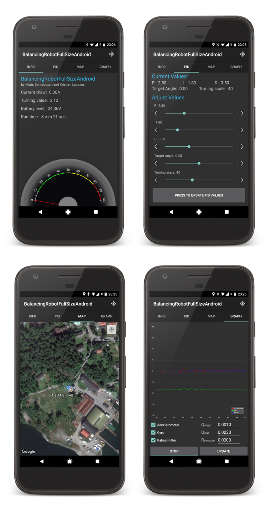

# Balancing robot full size Android app

#### Developed by Kristian Sloth Lauszus, 2014

The code is released under the GNU General Public License.
_________

This is the source code for the Android app I use for my full size balancing robot: <https://github.com/Lauszus/BalancingRobotFullSize>.

Detailed information can be found at the blog post: <http://blog.tkjelectronics.dk/2014/07/full-size-diy-balancing-robot/>.

# Screenshots

For more information send me an email at <lauszus@gmail.com>.
